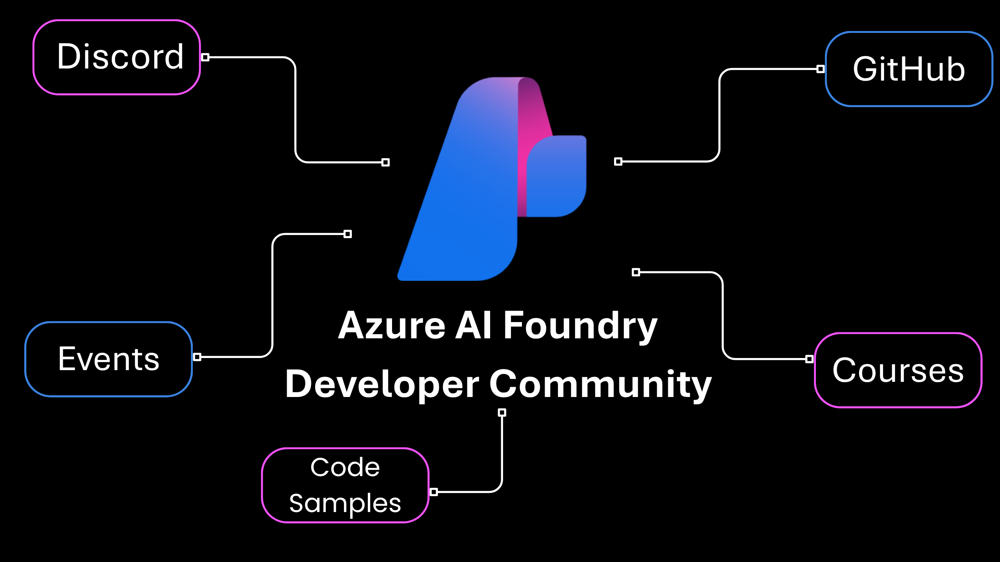

# Azure AI Foundry Developer Community

## Never build alone, join the community! 

### Get Started By: 

1. Join **over 30,000 other developers** in the Discord and GitHub Discussions on the [Community Links](#-community-links)

2. Attend the [Upcoming Events](#-upcoming-events) hosted by our teams at Microsoft to give you the latest updates on Azure AI Foundry and **answer your questions.**

3. Complete on our **free open source** [Courses](#-courses) to build fundamental skills in AI and AI Agents.

4. Use one of our [Code Samples](#-code-samples) to start building **your own AI applications.**

## 🔗 Community Links

### [Discord](https://discord.gg/aHu7bGMPcX)

Chat with other developers and AI Engineers, attend live community sessions hosted by Azure product teams and get support from product experts.

### [GitHub](https://aka.ms/community/gh-discussions)

Get your questions answered about Azure AI Foundry, share your feedback, and discuss ideas with the community.

## 📆 Upcoming Events

| **Event Name**                                                                                                                                      | **Description**                                                                                                                                                                                                                                                                     | **Date and Location**              |
|-----------------------------------------------------------------------------------------------------------------------------------------------------|-------------------------------------------------------------------------------------------------------------------------------------------------------------------------------------------------------------------------------------------------------------------------------------|------------------------------------|
| [MCP Dev Days](https://discord.gg/H3mCMmxS?event=1395140350401839135)                                   | Join us for MCP Dev Days, a two-day virtual event exploring the growing ecosystem around the Model Context Protocol (MCP), a standard that bridges AI models and the tools they rely on. | 29th/30th July 2025   |
| [.NET + AI - Weekly Office Hours](https://discord.gg/MkbhUsTPPe?event=1386772209611182108)                                                          | Join us every Monday for an .NET + AI Office Hours. Come with your questions or just listen in - it's a great chance to connect, share, and learn together!                                                                                                                         | Every Monday - Discord   |
| [Semnatic Kernel Community Office Hours](https://discord.gg/H3mCMmxS?event=1394369752058822718)                                            | Join us every Wednesday for Semantic Kernel Office Hours. Come with your questions or just listen in - it's a great chance to connect, share, and learn together!                                                                                                                                                     | Every Wednesday - Discord  |
| [Python + AI Office Hours](https://discord.gg/mFYRHC9r?event=1393434562394329158)                                            | Office hours for the following series: [RAG Deep Dive](https://developer.microsoft.com/en-us/reactor/series/S-1450/?wt.mc_id=facebook_S-1450_organicsocial_reactor)                                                                                                                                                      | Every Thursday - Discord  |
| [Foundry Fridays AMA](https://aka.ms/model-mondays/chat)                                             | Watch the weekly [Model Mondays Livestream](https://aka.ms/model-mondays/playlist) for the latest model announcements, tool demos and customer stories. Then join our [Foundry Friday AMA](https://aka.ms/model-mondays/forum) for conversations on the topic with subject matter experts! · **[2025 Series Schedule](https://aka.ms/model-mondays)** | Every Friday - Discord   |

## 📕 Courses

| **Course Name**                                                                         | **Description**                                                                                                                                                                 |
|-----------------------------------------------------------------------------------------|----------------------------------------------------------------------------------------------------------------------------------------------------------------------------------|
| [AI Agents for Beginners](https://github.com/microsoft/ai-agents-for-beginners)         | 11 Lessons teaching everything you need to know to start building AI Agents.                                                                                                    |
| [MCP For Beginners](https://github.com/microsoft/mcp-for-beginners)                     | Whether you're an AI developer, system architect, or software engineer, this guide is your comprehensive resource for mastering MCP fundamentals and implementation strategies. |
| [Generative AI for Beginners](https://github.com/Microsoft/generative-ai-for-beginners) | Learn the fundamentals of building Generative AI applications with our 21-lesson comprehensive course by Microsoft Cloud Advocates.                                             |

## 🚀 Code Samples

| **Repo**                                                                                                                  | **Description**                                                                                                                                                                                                                                                                                                                  |
|---------------------------------------------------------------------------------------------------------------------------|----------------------------------------------------------------------------------------------------------------------------------------------------------------------------------------------------------------------------------------------------------------------------------------------------------------------------------|
| [Azure AI Travel Agents with Llamaindex.TS and MCP](https://github.com/Azure-Samples/azure-ai-travel-agents)              | The AI Travel Agents is a robust enterprise application that leverages multiple AI agents to enhance travel agency operations. The application demonstrates how LlamaIndex.TS orchestrates multiple AI agents to assist employees in handling customer queries, providing destination recommendations, and planning itineraries. |
| [JS AI Build-a-thon](https://github.com/Azure-Samples/JS-AI-Build-a-thon?tab=readme-ov-file)                              | 9 Unique Hands-On Quests for JS/ TS Developers to Build AI Apps on Azure AI Foundry, and gain a deeper understanding of AI Technologies, Tools and Frameworks.                                                                                                                                                                   |
| [Getting Started with Agents Using Azure AI Foundry](https://github.com/Azure-Samples/get-started-with-ai-agents)         | The agent leverages the Azure AI Agent service and utilizes file search for knowledge retrieval from uploaded files, enabling it to generate responses with citations. The solution also includes built-in monitoring capabilities with tracing to ensure easier troubleshooting and optimized performance.                      |
| [RAG Time: Ultimate Guide to Mastering RAG](https://github.com/microsoft/rag-time)                                        | Master RAG with RAG Time! Learn how to build smarter AI applications with Retrieval-Augmented Generation. This repo includes step-by-step guides, live coding samples, and expert insights—everything you need to go from beginner to RAG pro!                                                                                   |
| [RAG chat app with Azure OpenAI and Azure AI Search (Python)](https://github.com/Azure-Samples/azure-search-openai-demo) | This solution creates a ChatGPT-like frontend experience over your own documents using RAG (Retrieval Augmented Generation). It uses Azure OpenAI Service to access GPT models, and Azure AI Search for data indexing and retrieval.                                                                                             |

